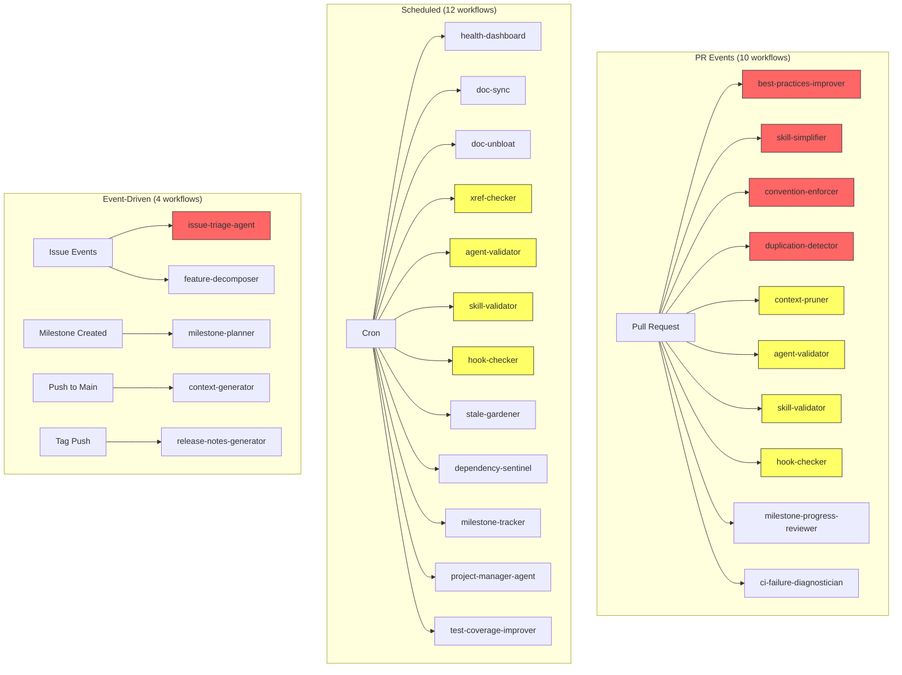
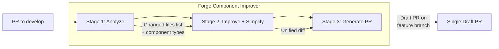

# Forge Agentic Workflow Optimization Plan

> **Technical Specification Document v1.0**
> *"Slash and Burn" — From 24 fragmented agents to a lean hybrid architecture*

---

## Table of Contents

1. [Architecture Overview](#1-architecture-overview)
2. [Objective 1: The CI Shift](#2-objective-1-the-ci-shift)
3. [Objective 2: Pipeline Consolidation](#3-objective-2-pipeline-consolidation)
4. [Objective 3: Trigger Hygiene](#4-objective-3-trigger-hygiene)
5. [Objective 4: Model-Prompt Tuning Strategy](#5-objective-4-model-prompt-tuning-strategy)
6. [Implementation Checklist](#6-implementation-checklist)
7. [Risk Register](#7-risk-register)

---

## 1. Architecture Overview

### Current State: 24 Fragmented Workflows



**Legend**: Red = consolidation target, Yellow = CI migration target

### Target State: Hybrid Architecture

```mermaid
graph TB
    subgraph "Deterministic CI (forge-tests.yml)"
        direction TB
        PUSH_PR[Push / PR Event] --> QG[Quality Gate]
        QG --> L1[Layer 1: Static Tests]
        QG --> VAL[Validation Jobs]
        VAL --> AV_CI[agent-validator]
        VAL --> SV_CI[skill-validator]
        VAL --> HC_CI[hook-checker]
        VAL --> XR_CI[xref-checker]
        VAL --> CP_CI[context-validator]
        VAL --> CE_CI[convention-checker]
        VAL --> DD_CI[duplication-detector]
        VAL --> HD_CI[health-aggregator]
        L1 --> L2[Layer 2: Integration]
        L2 --> E2E[E2E Tests]
    end

    subgraph "Agentic Pipelines (4 Mega-Workflows)"
        direction TB
        PR_EVENT[PR to develop/main] --> FCI[Forge Component Improver]
        FCI --> |Stage 1| FCI_A[Analyze Changes]
        FCI --> |Stage 2| FCI_S[Simplify + Improve]
        FCI --> |Stage 3| FCI_PR[Generate Draft PR]

        SCHEDULE[Schedule] --> FDM[Forge Doc Maintainer]
        FDM --> |Stage 1| FDM_S[Sync Check]
        FDM --> |Stage 2| FDM_U[Unbloat Review]
        FDM --> |Stage 3| FDM_PR[Generate Draft PR]

        MILE_EVENT[Milestone Events] --> FML[Forge Milestone Lifecycle]
        FML --> |Stage 1| FML_P[Plan Features]
        FML --> |Stage 2| FML_D[Decompose Work Items]
        FML --> |Stage 3| FML_T[Track Progress]
    end

    subgraph "Standalone Agentic (6 workflows)"
        direction TB
        CG_S[context-generator]
        RNG_S[release-notes-generator]
        DUS_S[dependency-sentinel]
        TC_S[test-coverage-improver]
        SG_S[stale-gardener]
        PMA_S[project-manager-agent]
    end

    subgraph "DECOMMISSIONED"
        ITA_X[issue-triage-agent ❌]
        CIF_X[ci-failure-diagnostician ❌ → CI]
    end

    style QG fill:#6f6,stroke:#333
    style FCI fill:#66f,stroke:#fff,color:#fff
    style FDM fill:#66f,stroke:#fff,color:#fff
    style FML fill:#66f,stroke:#fff,color:#fff
    style ITA_X fill:#999,stroke:#333
    style CIF_X fill:#999,stroke:#333
```



### Net Impact Summary

| Metric | Before | After | Delta |
|--------|--------|-------|-------|
| Total agentic workflows | 24 | 9 | -15 (-63%) |
| PR-triggered agentic runs | 10 per PR | 1-2 per PR | -80% |
| Scheduled agentic runs/week | ~20 | ~8 | -60% |
| Deterministic CI jobs | 3 | 11 | +8 |
| Estimated monthly LLM cost | ~$500+ | ~$150 | -70% |
| No-op agentic runs/month | ~480 | ~20 | -96% |

---

## 2. Objective 1: The CI Shift

### Identification: 8 Validation Workflows → Deterministic CI

These 8 workflows perform **structural validation** that requires no LLM reasoning — only file existence checks, schema validation, pattern matching, and cross-referencing. Every check they perform can be expressed as pytest assertions, jq queries, grep patterns, or shellcheck invocations.

| # | Workflow File | Current Trigger | Core Checks | CI Tool |
|---|---|---|---|---|
| 1 | `forge-agent-validator.md` | Schedule + PR (agents changed) | JSON schema compliance, file parity, skill/MCP ref existence | `pytest` + `jsonschema` + `jq` |
| 2 | `forge-skill-validator.md` | Schedule + PR (skills changed) | Template section presence, 6-step workflow, examples.md existence | `pytest` + `grep` |
| 3 | `forge-hook-checker.md` | Schedule + PR (hooks changed) | `set -euo pipefail`, shellcheck, hooks.json registration, HOOKS_GUIDE.md mention | `shellcheck` + `grep` + `jq` |
| 4 | `forge-xref-checker.md` | Schedule only | 8 cross-reference matrices (skills↔context, agents↔skills, etc.) | `pytest` + `jq` + `grep` |
| 5 | `forge-context-pruner.md` | PR (context changed) | Frontmatter validation, index integrity, orphaned/ghost entries | `pytest` + `pyyaml` |
| 6 | `forge-convention-enforcer.md` | PR (any forge files) | Kebab-case naming, frontmatter presence, `set -euo pipefail` | `pytest` + `grep` |
| 7 | `forge-duplication-detector.md` | PR (any forge files) | Content block similarity (>70% match) across 2+ files | `pytest` + `difflib` |
| 8 | `forge-health-dashboard.md` | Schedule (weekly) | Aggregate counts, file existence, cross-ref tallies | `pytest` + `jq` + custom aggregator |

### Expanded `forge-tests.yml` Design

The existing `forge-tests.yml` has 3 jobs (layer1-ci, layer2-hooks, layer2-e2e). We add 8 parallel validation jobs that run alongside Layer 1.

```yaml
# New jobs to add to forge-tests.yml
# All run in parallel with layer1-ci (no dependency)

  validate-agents:
    name: "Validate Agent Configs"
    runs-on: ubuntu-latest
    steps:
      - uses: actions/checkout@v4
      - uses: actions/setup-python@v5
        with:
          python-version: '3.12'
      - run: pip install pytest pyyaml jsonschema
      - run: python -m pytest forge-plugin/tests/layer1/test_agent_validation.py -v --tb=short

  validate-skills:
    name: "Validate Skill Structure"
    runs-on: ubuntu-latest
    steps:
      - uses: actions/checkout@v4
      - uses: actions/setup-python@v5
        with:
          python-version: '3.12'
      - run: pip install pytest pyyaml
      - run: python -m pytest forge-plugin/tests/layer1/test_skill_validation.py -v --tb=short

  validate-hooks:
    name: "Validate Hook Quality"
    runs-on: ubuntu-latest
    steps:
      - uses: actions/checkout@v4
      - run: sudo apt-get update && sudo apt-get install -y jq shellcheck
      - run: bash forge-plugin/tests/layer1/test_hook_quality.sh

  validate-xrefs:
    name: "Validate Cross-References"
    runs-on: ubuntu-latest
    steps:
      - uses: actions/checkout@v4
      - uses: actions/setup-python@v5
        with:
          python-version: '3.12'
      - run: pip install pytest pyyaml jsonschema
      - run: python -m pytest forge-plugin/tests/layer1/test_xref_integrity.py -v --tb=short

  validate-context:
    name: "Validate Context Integrity"
    runs-on: ubuntu-latest
    steps:
      - uses: actions/checkout@v4
      - uses: actions/setup-python@v5
        with:
          python-version: '3.12'
      - run: pip install pytest pyyaml
      - run: python -m pytest forge-plugin/tests/layer1/test_context_integrity.py -v --tb=short

  validate-conventions:
    name: "Validate Conventions"
    runs-on: ubuntu-latest
    steps:
      - uses: actions/checkout@v4
      - uses: actions/setup-python@v5
        with:
          python-version: '3.12'
      - run: pip install pytest pyyaml
      - run: python -m pytest forge-plugin/tests/layer1/test_conventions.py -v --tb=short

  detect-duplication:
    name: "Detect Content Duplication"
    runs-on: ubuntu-latest
    steps:
      - uses: actions/checkout@v4
      - uses: actions/setup-python@v5
        with:
          python-version: '3.12'
      - run: pip install pytest
      - run: python -m pytest forge-plugin/tests/layer1/test_duplication.py -v --tb=short

  health-aggregator:
    name: "Health Score Aggregator"
    runs-on: ubuntu-latest
    needs:
      - validate-agents
      - validate-skills
      - validate-hooks
      - validate-xrefs
      - validate-context
      - validate-conventions
      - detect-duplication
    steps:
      - uses: actions/checkout@v4
      - run: sudo apt-get update && sudo apt-get install -y jq
      - run: bash forge-plugin/tests/layer1/test_health_score.sh
```

### Test File Specifications

Each new pytest file implements the exact checks from the corresponding agentic workflow:

| Test File | Assertions | Source Workflow |
|---|---|---|
| `test_agent_validation.py` | Schema compliance (jsonschema), skill ref existence, context domain existence, MCP ref existence, `.md`/`.config.json` parity, kebab-case naming | `forge-agent-validator.md` checks 1-7 |
| `test_skill_validation.py` | Required sections from SKILL_TEMPLATE.md, 6-step workflow keywords, `examples.md` existence, no hardcoded paths, OUTPUT_CONVENTIONS.md reference | `forge-skill-validator.md` checks 1-5 |
| `test_hook_quality.sh` | `set -euo pipefail` grep, shellcheck pass, hooks.json registration (jq), HOOKS_GUIDE.md mention, no blocking patterns | `forge-hook-checker.md` checks 1-8 |
| `test_xref_integrity.py` | All 8 cross-reference matrices from xref-checker: skills↔context, skills↔agents, skills↔commands, agents↔MCPs, context↔indexes, hooks↔registry, hooks↔docs, commands↔context | `forge-xref-checker.md` matrices 1-8 |
| `test_context_integrity.py` | Required frontmatter fields (id, domain, title, type, estimatedTokens, loadingStrategy, version, lastUpdated, sections, tags), index consistency, orphan/ghost detection | `forge-context-pruner.md` checks 1-4 |
| `test_conventions.py` | Kebab-case directories, agent file pairing, context frontmatter presence, `set -euo pipefail` in hooks, ATX heading consistency | `forge-convention-enforcer.md` rules 1-5 |
| `test_duplication.py` | Python `difflib.SequenceMatcher` with 0.7 ratio threshold across skill/context/hook files; report clusters of >70% similar content blocks | `forge-duplication-detector.md` scan 1-4 |
| `test_health_score.sh` | Aggregate counts (skills, agents, hooks, context), cross-ref tally from other job outputs, generate JSON health report artifact | `forge-health-dashboard.md` sections 1-6 |

### Decommission Plan for Migrated Workflows

After CI tests are passing:

1. **Remove the `on: schedule` and `on: pull_request` triggers** from all 8 `.md` files (keep `on: workflow_dispatch` only as escape hatch)
2. **Add deprecation header** to each file: `# DEPRECATED: Migrated to forge-tests.yml — see validate-{name} job`
3. **After 2 weeks** of clean CI runs: delete the 8 `.md` files and their `.lock.yml` counterparts
4. **Update AGENTIC_FORGE.md** and **AGENTIC_WORKFLOWS_ROADMAP.md** to reflect migration

---

## 3. Objective 2: Pipeline Consolidation

### 3.1 Forge Component Improver

**Replaces**: `forge-best-practices-improver.md` + `forge-skill-simplifier.md`

**Rationale**: Both are PR-triggered, both create draft PRs on the feature branch, both analyze changed skill/agent/context files. The only difference is the lens (best practices vs. verbosity). A single multi-stage pipeline eliminates duplicate file reads and produces one coherent PR instead of two competing ones.



**Workflow Design**:

```yaml
# forge-component-improver.md frontmatter
on:
  pull_request:
    types: [opened, synchronize]
    branches: [develop]
    paths:
      - "forge-plugin/skills/**"
      - "forge-plugin/agents/**"
      - "forge-plugin/commands/**"
      - "forge-plugin/context/**"
  workflow_dispatch:
safe-outputs:
  create-pull-request:
    labels: ["forge-automation", "improvement", "quality"]
    title-prefix: "[improve] "
    expires: 7
    draft: true
    if-no-changes: "ignore"
```

**Prompt Structure (3 Stages)**:

| Stage | Task | Input | Output |
|---|---|---|---|
| **1. Analyze** | List changed files, classify by component type (skill/agent/command/context), read each file | PR changed files list | Structured analysis: file → component type → current state |
| **2. Improve + Simplify** | For each file: (a) check against best practices (interface refs, 6-step workflow, schema compliance) and (b) check for verbosity (redundant sections, over-long prose, dead refs) | Stage 1 analysis | Unified improvement list: file → changes → rationale |
| **3. Generate PR** | Apply all changes, write PR body with before/after comparisons grouped by improvement type | Stage 2 improvements | Single draft PR on feature branch |

**Key Change**: The convention enforcer's *validation* moves to CI (Objective 1). The convention enforcer's *PR-creating behavior* (auto-fixing conventions) is absorbed into Stage 2 of the Component Improver for files that are already being touched.

### 3.2 Forge Doc Maintainer

**Replaces**: `forge-doc-sync.md` + `forge-doc-unbloat.md`

**Rationale**: Both target the same 5-6 documentation files. Doc Sync checks accuracy; Doc Unbloat checks verbosity. Running them as separate scheduled workflows means the same files are read twice per week by two different LLM agents producing two competing PRs. One combined workflow reads once, fixes both problems, creates one PR.

```yaml
# forge-doc-maintainer.md frontmatter
on:
  schedule: "0 7 * * 1,4"  # Monday + Thursday (covers both original schedules)
  workflow_dispatch:
safe-outputs:
  create-pull-request:
    labels: ["forge-automation", "documentation", "maintenance"]
    title-prefix: "[docs] "
    expires: 7
    draft: true
    if-no-changes: "ignore"
```

**Prompt Structure (2 Stages)**:

| Stage | Task | Original Workflow |
|---|---|---|
| **1. Sync Check** | Validate counts, paths, references, capability claims, index consistency | `forge-doc-sync.md` |
| **2. Unbloat Review** | Remove duplicate paragraphs, convert prose to bullets, deduplicate guidance | `forge-doc-unbloat.md` |

**Output**: Single draft PR with sync fixes and unbloat improvements, clearly separated in the PR body.

### 3.3 Forge Milestone Lifecycle

**Replaces**: `forge-milestone-planner.md` + `forge-project-milestone-tracker.md` + `forge-milestone-progress-reviewer.md`

**Rationale**: These three workflows form a natural lifecycle (plan → track → review) but currently operate independently, creating duplicate issue noise and redundant milestone analysis. The milestone planner creates features, the tracker creates daily status issues, and the progress reviewer creates gap issues on every PR. A single lifecycle workflow with event-based stage routing eliminates overlap.

```yaml
# forge-milestone-lifecycle.md frontmatter
on:
  milestone:
    types: [created]
  schedule: "daily"
  pull_request:
    types: [opened, synchronize]
  workflow_dispatch:
safe-outputs:
  create-issue:
    labels: ["forge-automation", "milestones", "planning"]
    title-prefix: "[milestone] "
    max: 5
    close-older-issues: true
    expires: 30
```

**Stage Routing by Event**:

| Trigger | Stage | Behavior | Original Workflow |
|---|---|---|---|
| `milestone.created` | **Plan** | Decompose into 3-5 feature issues, associate existing issues | `forge-milestone-planner.md` |
| `schedule` (daily) | **Track** | Progress report, blocked items, velocity, reprioritization | `forge-project-milestone-tracker.md` |
| `pull_request` | **Review** | PR contribution analysis, gap detection, remediation issues | `forge-milestone-progress-reviewer.md` |

**Key Design Decision**: The prompt body uses conditional sections:

```markdown
## Event Routing

Determine which stage to execute based on the triggering event:

- If triggered by `milestone.created` → Execute **Planning Stage**
- If triggered by `schedule` → Execute **Tracking Stage**
- If triggered by `pull_request` → Execute **Review Stage**
- If triggered by `workflow_dispatch` → Execute **Tracking Stage** (manual check)
```

### 3.4 Forge Quality Gate (CI — Not Agentic)

**Replaces**: The aggregation role of `forge-health-dashboard.md`

This is **not** an agentic workflow. It is the expanded `forge-tests.yml` from Objective 1 — the `health-aggregator` job that runs after all 7 validation jobs complete. It produces a machine-readable JSON artifact with pass/fail/warning counts per category.

The *narrative reporting* aspect of the Health Dashboard (growth trends, delivery metrics, executive summary) requires LLM reasoning and remains as a **standalone scheduled agentic workflow** — but it now *consumes* the CI artifact instead of re-running all checks from scratch.

### Consolidation Summary

| Before | After | Reduction |
|---|---|---|
| `best-practices-improver` + `skill-simplifier` + `convention-enforcer` (PR-fix part) | **Forge Component Improver** | 3 → 1 |
| `doc-sync` + `doc-unbloat` | **Forge Doc Maintainer** | 2 → 1 |
| `milestone-planner` + `milestone-tracker` + `milestone-progress-reviewer` | **Forge Milestone Lifecycle** | 3 → 1 |
| 8 validation workflows | **forge-tests.yml** (deterministic CI) | 8 → 0 agentic |

**Total agentic workflows**: 24 → 9 (3 consolidated + 6 standalone)

---

## 4. Objective 3: Trigger Hygiene

### No-Op Analysis

Based on workflow trigger definitions and repository activity patterns:

| Workflow | Current Trigger | No-Op Rate | Root Cause |
|---|---|---|---|
| `feature-decomposer` | `issues: [opened, labeled]` — ALL issues | ~90% | Fires on every issue open/label, but only acts on `milestone-feature` label |
| `issue-triage-agent` | `issues: [opened, reopened]` — ALL issues | ~96% | Creates triage issue for every human issue, but 96% of issues are automation-generated |
| `milestone-progress-reviewer` | `pull_request: [opened, synchronize]` — ALL PRs | ~85% | Fires on every PR, but most PRs have no milestone association |
| `best-practices-improver` | `pull_request` to `develop` — ALL PR files | ~70% | Fires even when no skill/agent/command/context files changed |
| `skill-simplifier` | `pull_request` to `develop`/`main` — ALL PR files | ~70% | Same: fires even when no skill files changed |
| `duplication-detector` | `pull_request` — ALL PR files | ~60% | Fires on all PRs regardless of file type |
| `convention-enforcer` | `pull_request` — ALL PR files | ~60% | Same broad trigger |
| `context-pruner` | `pull_request` — ALL PR files | ~50% | Fires even when no context files changed |

### Fix 1: Feature Decomposer — Label Filter

**Problem**: Triggers on `issues: [opened, labeled]` but only operates on issues with `milestone-feature` label. Every issue open or label event burns an agentic run.

**Fix**: The gh-aw framework does not support label filters in the `on:` frontmatter. The loop prevention logic in the prompt body is the correct approach. However, we can make it fail faster by **restructuring the prompt to check labels in the first 2 lines** before any file reads.

```yaml
# forge-feature-decomposer.md — FIXED trigger
on:
  issues:
    types: [labeled]  # Remove 'opened' — only fire when a label is added
  workflow_dispatch:
```

**Prompt Addition (first line)**:

```markdown
## IMMEDIATE EXIT CHECK

Before any analysis: Check if the triggering issue has the `milestone-feature` label.
If NOT present, output "No milestone-feature label found. Exiting." and stop.
Do NOT read any files or make any API calls before this check.
```

**Impact**: ~90% reduction in feature-decomposer runs. Issues are only labeled `milestone-feature` by the milestone planner (~2-3 times per milestone).

### Fix 2: Issue Triage Agent — DECOMMISSION

**Problem**: Creates a `[triage]` companion issue for every human-created issue. In practice:
- The Forge is a single-maintainer project — triage is done manually in seconds
- The triage issue adds noise (doubles the issue count)
- Loop prevention works, but every issue still triggers an agentic run
- 96% of runs produce low-value output

**Action**: **Disable immediately**. Remove all triggers except `workflow_dispatch`.

```yaml
# forge-issue-triage-agent.md — DISABLED
on:
  workflow_dispatch:  # Manual-only escape hatch
# issues:  # REMOVED — decommissioned
#   types: [opened, reopened]
```

**Phase 2**: Delete the workflow file entirely after confirming no one uses manual dispatch.

### Fix 3: Milestone Progress Reviewer — Association Pre-Filter

**Problem**: Fires on ALL PRs. The prompt has a 4-step "Association Detection Hierarchy" that exits early if no milestone link is found — but the agentic run is already billed.

**Fix**: After consolidation into Forge Milestone Lifecycle, the PR trigger gets `paths` filtering:

```yaml
# In forge-milestone-lifecycle.md
on:
  pull_request:
    types: [opened, synchronize]
    # Only fire when forge-plugin files change (milestone work typically touches these)
    paths:
      - "forge-plugin/**"
      - "ROADMAP.md"
      - ".github/workflows/forge-*.md"
```

**Prompt Pre-Filter**:

```markdown
## PR MILESTONE CHECK (execute first)

1. Check if PR title or body contains issue references (#NNN)
2. Check if PR has a milestone assigned
3. If NEITHER condition is met, exit immediately without further analysis
```

### Fix 4: Component Improver — Paths Filter (Post-Consolidation)

**Problem**: Best-practices-improver and skill-simplifier fire on ALL PR files but only care about `forge-plugin/skills/**`, `forge-plugin/agents/**`, `forge-plugin/commands/**`, and `forge-plugin/context/**`.

**Fix**: Already addressed in the Component Improver consolidation (Section 3.1) — the `paths` filter restricts to these 4 directories.

### Fix 5: CI Failure Diagnostician — Conditional Trigger

```yaml
# forge-ci-failure-diagnostician.md — TIGHTEN
on:
  workflow_run:
    workflows: ["Forge Tests"]
    types: [completed]
    branches: [main, develop]
    # Only fires when Forge Tests fails — gh-aw handles this via
    # the workflow_run event type. Add prompt pre-check:
```

**Prompt Pre-Check**:

```markdown
## FAILURE CHECK

Check the triggering workflow run's conclusion.
If conclusion is "success", exit immediately.
Only proceed if conclusion is "failure" AND this is the 2nd consecutive failure
(check previous run of same workflow).
```

### Trigger Hygiene Summary

| Workflow | Fix | Estimated No-Op Reduction |
|---|---|---|
| `feature-decomposer` | Remove `opened` from types, label-first prompt check | 90% → <10% |
| `issue-triage-agent` | **DECOMMISSION** | 100% eliminated |
| `milestone-progress-reviewer` | Consolidate + paths filter + prompt pre-filter | 85% → <20% |
| `best-practices-improver` | Consolidate into Component Improver with paths filter | 70% → <10% |
| `skill-simplifier` | Consolidate into Component Improver with paths filter | 70% → <10% |
| `convention-enforcer` | Validation → CI; PR-fix → Component Improver | 60% → 0% (CI) |
| `duplication-detector` | Migrate to CI | 60% → 0% (CI) |
| `context-pruner` | Migrate to CI | 50% → 0% (CI) |

---

## 5. Objective 4: Model-Prompt Tuning Strategy

### Model Tier Assignments

| Model | Codename | Strengths | Cost/1M tokens | Assigned Workflows |
|---|---|---|---|---|
| **gpt-5.1-codex-mini** | "The Scalpel" | High-speed tool use, grep mastery, massive refactors | ~$1.50 | Component Improver, Context Generator |
| **gpt-4.1** | "The Surgeon" | Precise editing, diff generation, low hallucination | ~$2.00 | Doc Maintainer, Release Notes Generator |
| **gemini-3-pro** | "The Context King" | 1M+ token window, deep cross-file analysis | ~$1.25 | Health Dashboard, Milestone Lifecycle |
| **claude-opus-4.6** | "The Strat" | Logic sanity, strategic reasoning, safety checks | ~$15.00 | Project Manager Agent (weekly only) |

### Model-Prompt Matrix

| Workflow | Model | System Prompt Strategy | Prompt Techniques | Rationale |
|---|---|---|---|---|
| **Forge Component Improver** | gpt-5.1-codex-mini | **Tool-Use-First**: System prompt emphasizes `grep`, `find`, `jq` tool calls before any analysis. Opens with "You have access to the following tools..." | **Few-Shot** exemplars for each component type (skill, agent, command, context). **Structured Output** via JSON schema for improvement list. **Chain-of-Action** pattern: "For each file: 1) Read 2) Check rules 3) Propose fix" | Codex-mini excels at mechanical file operations. Feed it rules as a checklist, not prose. Keep system prompt under 2K tokens — move reference material to tool-fetched context. |
| **Forge Doc Maintainer** | gpt-4.1 | **Precision Editor**: System prompt defines output as unified diff format. Opens with "You are a documentation editor. Your output must be exact, character-perfect diffs." | **Before/After Few-Shot** pairs (3 examples of sync fixes, 2 of unbloat). **Constraint-First** prompting: list all DON'Ts before DOs. **Self-Verification** step: "After generating changes, verify each change preserves factual accuracy." | GPT-4.1's strength is precise editing. Give it the full file content (fits easily in context) and ask for surgical changes. Avoid abstract instructions — be concrete. |
| **Forge Milestone Lifecycle** | gemini-3-pro | **Needle-in-Haystack Retrieval**: System prompt uses XML data delimiting for large context injection. Opens with `<milestone-data>...</milestone-data>`, `<issues>...</issues>`, `<prs>...</prs>` | **XML Data Delimiting** for all structured input (milestone metadata, issue lists, PR lists). **Chain-of-Thought** with explicit `<reasoning>` tags before each output section. **Multi-Document QA** pattern: "Given the following documents, answer..." | Gemini's 1M+ context window can ingest ALL milestone issues, ALL PRs, and the full ROADMAP in a single prompt. Use XML tags to help retrieval. Always request reasoning traces for auditability. |
| **Health Dashboard** | gemini-3-pro | **Aggregation Analyst**: System prompt provides all raw data from CI health-aggregator artifact as `<ci-data>` XML block. | **Template-Completion**: Provide the exact output template (the issue body from health-dashboard.md) with `{placeholder}` values. **Few-Shot** with one complete example report. **Data-to-Narrative** instruction: "Convert these metrics into traffic-light assessments and trend analysis." | The dashboard needs to read ~200+ files for counts and cross-refs. With CI handling the raw counts, Gemini only needs to narrativize the data — play to its summarization strength. |
| **Release Notes Generator** | gpt-4.1 | **Structured Classifier**: System prompt defines PR categories with explicit classification rules. | **Few-Shot Classification**: 5 examples of PR → category mapping. **Structured Output** in markdown template. **Exhaustive Enumeration**: "Classify EVERY merged PR. Do not skip any." | Release notes need precision (correct category, correct PR references) not creativity. GPT-4.1's low hallucination rate is critical here. |
| **Context Generator** | gpt-5.1-codex-mini | **Template Expander**: System prompt provides the context file template and asks for mechanical expansion from skill content. | **Template Fill**: Provide YAML frontmatter template + skill SKILL.md content, ask for template completion. **Tool-Use** to read skill files and generate context. | Mechanical content generation from templates — perfect for codex-mini's speed. |
| **Dependency Sentinel** | gpt-5.1-codex-mini | **Scanner**: System prompt lists dependency surfaces to check with grep/find patterns. | **Checklist Execution**: Numbered steps for each dependency check. **Tool-Use-First** for file scanning. | Dependency checking is mostly pattern matching on version strings. |
| **Test Coverage Improver** | gpt-5.1-codex-mini | **Test Generator**: System prompt provides test patterns from existing test files as few-shot examples. | **Pattern Replication**: "Given these existing tests, generate tests following the same patterns for uncovered areas." **Structured Output** as pytest files. | Test generation from patterns is codex-mini's sweet spot. |
| **Stale Gardener** | gpt-4.1 | **Conservative Curator**: System prompt emphasizes "when in doubt, don't close." | **Decision Tree** prompting: explicit if/then rules for stale classification. **Grace Period Logic**: "Items inactive for 30 days get warning. Items inactive for 60 days get close recommendation." | Stale management needs judgment (is this really abandoned?) — GPT-4.1 balances precision with reasoning. |
| **Project Manager Agent** | claude-opus-4.6 | **Strategic Advisor**: System prompt establishes role as senior PM with ROADMAP as primary source of truth. | **Chain-of-Thought** with explicit reasoning sections. **System Role** as "Principal AI PM." **Socratic Prompting**: "For each roadmap item, ask: Is it started? Is it blocked? Is it still relevant?" | This is the only workflow where strategic reasoning (not tool use or editing) is the primary value. Claude Opus's logic and safety-consciousness are worth the premium for weekly runs only. |

### Prompt Engineering Standards

#### Standard 1: Model-Appropriate System Prompts

```
┌─────────────────────────────────────────────────────────────┐
│ gpt-5.1-codex-mini System Prompt Template                   │
│                                                             │
│ You are a code operations agent. You have these tools:      │
│ [tool list]                                                 │
│                                                             │
│ RULES (follow exactly):                                     │
│ 1. [rule as imperative statement]                           │
│ 2. [rule as imperative statement]                           │
│                                                             │
│ OUTPUT FORMAT:                                              │
│ ```json                                                     │
│ { "changes": [...] }                                        │
│ ```                                                         │
│                                                             │
│ EXAMPLES:                                                   │
│ [3-5 input→output pairs]                                    │
│                                                             │
│ Keep system prompt < 2,000 tokens.                          │
│ Use tools to fetch context, don't embed it.                 │
└─────────────────────────────────────────────────────────────┘

┌─────────────────────────────────────────────────────────────┐
│ gpt-4.1 System Prompt Template                              │
│                                                             │
│ You are a precision editor. Your changes must be:           │
│ - Character-perfect (no extra whitespace, no typos)         │
│ - Minimal (smallest diff that achieves the goal)            │
│ - Verified (re-read your output before submitting)          │
│                                                             │
│ CONSTRAINTS (violating these is a failure):                 │
│ 1. [constraint with example of violation]                   │
│ 2. [constraint with example of violation]                   │
│                                                             │
│ Before/After examples:                                      │
│ [3 pairs showing exact edits]                               │
│                                                             │
│ After generating changes, verify:                           │
│ □ All file paths exist                                      │
│ □ All changes preserve meaning                              │
│ □ No content was invented                                   │
│                                                             │
│ System prompt can be 3,000-5,000 tokens.                    │
│ Embed reference material directly.                          │
└─────────────────────────────────────────────────────────────┘

┌─────────────────────────────────────────────────────────────┐
│ gemini-3-pro System Prompt Template                         │
│                                                             │
│ You are a research analyst with access to a large corpus.   │
│                                                             │
│ <corpus>                                                    │
│   <document id="roadmap">                                   │
│     {ROADMAP content}                                       │
│   </document>                                               │
│   <document id="milestone-123">                             │
│     {milestone data}                                        │
│   </document>                                               │
│   <document id="issues">                                    │
│     {all milestone issues as XML}                           │
│   </document>                                               │
│ </corpus>                                                   │
│                                                             │
│ Answer questions by citing specific documents.              │
│ Use <reasoning>...</reasoning> tags before each conclusion. │
│ Use <evidence doc="id" line="N">quote</evidence> for refs.  │
│                                                             │
│ System prompt can be 10,000-50,000 tokens.                  │
│ Embed ALL reference data directly in XML tags.              │
└─────────────────────────────────────────────────────────────┘

┌─────────────────────────────────────────────────────────────┐
│ claude-opus-4.6 System Prompt Template                      │
│                                                             │
│ You are a Principal AI Solutions Architect.                  │
│                                                             │
│ Your role is strategic analysis, not code generation.        │
│ Think step by step. Explain your reasoning.                 │
│ When uncertain, say so — do not fabricate.                   │
│                                                             │
│ Context:                                                    │
│ [Concise project context, 500-1000 tokens]                  │
│                                                             │
│ Task:                                                       │
│ [Clear deliverable with acceptance criteria]                │
│                                                             │
│ System prompt should be 1,000-2,000 tokens.                 │
│ Rely on Claude's reasoning, not prompt engineering tricks.   │
│ Use Chain-of-Thought naturally, not forced.                  │
└─────────────────────────────────────────────────────────────┘
```

#### Standard 2: Anti-Patterns by Model

| Model | DO NOT | WHY |
|---|---|---|
| gpt-5.1-codex-mini | Long prose instructions, abstract concepts, "think step by step" | Codex models optimize for action, not reflection. Verbose prompts waste the speed advantage. |
| gpt-4.1 | Ambiguous output formats, "be creative", open-ended exploration | GPT-4.1 is a precision instrument. Vague instructions produce vague outputs. |
| gemini-3-pro | Small context windows, sequential tool calls, single-document analysis | Gemini's value is the 1M window. Artificially constraining context wastes the advantage. |
| claude-opus-4.6 | Mechanical tasks, pattern matching, bulk file operations | At $15/M tokens, using Opus for grep-equivalent work is economic malpractice. |

---

## 6. Implementation Checklist

### Phase 1: Quick Wins (Week 1-2)

> **Goal**: Eliminate waste without restructuring. Immediate cost reduction.

- [ ] **Disable issue-triage-agent**: Remove `issues:` trigger, keep `workflow_dispatch` only
- [ ] **Fix feature-decomposer trigger**: Change `types: [opened, labeled]` to `types: [labeled]`
- [ ] **Add label-first exit check** to feature-decomposer prompt body (first line)
- [ ] **Add paths filters** to existing PR-triggered workflows:
  - `best-practices-improver`: Add `paths: [forge-plugin/skills/**, forge-plugin/agents/**, forge-plugin/commands/**, forge-plugin/context/**]`
  - `skill-simplifier`: Add `paths: [forge-plugin/skills/**]`
  - `convention-enforcer`: Add `paths: [forge-plugin/**]`
  - `duplication-detector`: Add `paths: [forge-plugin/**]`
  - `context-pruner`: Add `paths: [forge-plugin/context/**]`
- [ ] **Add milestone pre-check** to milestone-progress-reviewer prompt
- [ ] **Run `gh aw compile`** — verify 0 errors, 0 warnings
- [ ] **Update AGENTIC_FORGE.md** with trigger changes
- [ ] **Monitor for 2 weeks**: Track run counts, no-op rates, false positive rates

### Phase 2: CI Migration (Week 3-5)

> **Goal**: Move 8 validators to deterministic CI.

- [ ] **Write 7 pytest test files** (one per validator, see Section 2):
  - `test_agent_validation.py`
  - `test_skill_validation.py`
  - `test_xref_integrity.py`
  - `test_context_integrity.py`
  - `test_conventions.py`
  - `test_duplication.py`
- [ ] **Write 2 bash test scripts**:
  - `test_hook_quality.sh`
  - `test_health_score.sh`
- [ ] **Expand `forge-tests.yml`** with 8 new parallel jobs (see Section 2 YAML)
- [ ] **Run CI pipeline** — verify all 8 new jobs pass
- [ ] **Disable schedule triggers** on 8 migrated workflows (keep `workflow_dispatch`)
- [ ] **Run both systems in parallel for 1 week** — compare CI results vs. agentic outputs
- [ ] **Remove PR triggers** from 8 migrated workflows
- [ ] **Update documentation**: AGENTIC_FORGE.md, AGENTIC_WORKFLOWS_ROADMAP.md, CLAUDE.md

### Phase 3: Pipeline Consolidation (Week 6-8)

> **Goal**: Replace fragmented workflows with mega-workflows.

- [ ] **Create `forge-component-improver.md`**:
  - Merge prompt logic from `best-practices-improver` + `skill-simplifier`
  - Add 3-stage structure (Analyze → Improve/Simplify → Generate PR) each stage should still be a seperate action with dependency on the previous stage
  - Add `paths` filter for forge-plugin directories
  - Run `gh aw compile` — verify 0 errors
- [ ] **Create `forge-doc-maintainer.md`**:
  - Merge prompt logic from `doc-sync` + `doc-unbloat`
  - Consolidate schedule to Mon + Thu
  - Run `gh aw compile` — verify 0 errors
- [ ] **Create `forge-milestone-lifecycle.md`**:
  - Merge prompt logic from `milestone-planner` + `milestone-tracker` + `milestone-progress-reviewer`
  - Add event-routing logic in prompt
  - Run `gh aw compile` — verify 0 errors
- [ ] **Disable replaced workflows** (remove triggers, add deprecation header)
- [ ] **Run consolidated workflows via `workflow_dispatch`** — verify output quality
- [ ] **Monitor for 2 weeks** — compare output quality vs. original workflows
- [ ] **Delete deprecated workflow files** and their `.lock.yml` counterparts

### Phase 4: Model Tiering (Week 9-10)

> **Goal**: Assign models and tune prompts per the Model-Prompt Matrix.

- [ ] **Evaluate gh-aw model selection support** — determine if model can be specified in frontmatter or if it requires engine-level configuration
- [ ] **Rewrite system prompts** for each workflow per Model-Prompt Matrix (Section 5)
- [ ] **Create prompt templates** in `shared/` for each model tier
- [ ] **A/B test**: Run each workflow with assigned model vs. default — compare output quality and cost
- [ ] **Document model assignments** in AGENTIC_WORKFLOWS_ROADMAP.md
- [ ] **Set up cost monitoring** dashboard for per-workflow token usage

### Phase 5: Cleanup and Documentation (Week 11-12)

- [ ] **Delete all deprecated workflow `.md` files** (8 validators + 6 replaced)
- [ ] **Delete all corresponding `.lock.yml` files**
- [ ] **Update AGENTIC_FORGE.md** — rewrite "Complete Workflow Catalog" section
- [ ] **Update AGENTIC_WORKFLOWS_ROADMAP.md** — update current state table
- [ ] **Update CLAUDE.md Section XVI** — update workflow counts and architecture
- [ ] **Update README.md** — update agentic workflow counts
- [ ] **Final audit**: Run `gh aw status` — verify only 9 workflows remain
- [ ] **Celebrate**: 24 → 9 workflows, ~70% cost reduction, <10% no-op rate

---

## 7. Risk Register

| Risk | Impact | Likelihood | Mitigation |
|---|---|---|---|
| CI tests miss edge cases that LLM caught | Medium | Medium | Run both systems in parallel (Phase 2) for 1 week before decommissioning agentic versions |
| Consolidated workflows produce lower-quality output | Medium | Low | A/B testing during Phase 3; keep `workflow_dispatch` on deprecated workflows as rollback |
| gh-aw doesn't support multi-stage prompt routing | High | Medium | Fallback: use conditional sections in single prompt body (tested in milestone-lifecycle design) |
| Model tiering requires engine changes beyond frontmatter | Medium | High | Phase 4 is independent — can proceed with default model if gh-aw doesn't support selection |
| Removing issue-triage-agent frustrates contributors | Low | Low | It was single-maintainer project; triage was manual anyway |
| Paths filters are too aggressive, missing valid triggers | Medium | Low | Start with broad paths (`forge-plugin/**`), tighten iteratively based on monitoring |

---

## Appendix A: Final Workflow Inventory (Target State)

### Deterministic CI (`forge-tests.yml`)

| Job | Original Workflow | Tools |
|---|---|---|
| `validate-agents` | `forge-agent-validator` | pytest, jsonschema, jq |
| `validate-skills` | `forge-skill-validator` | pytest, grep |
| `validate-hooks` | `forge-hook-checker` | shellcheck, grep, jq |
| `validate-xrefs` | `forge-xref-checker` | pytest, jq, grep |
| `validate-context` | `forge-context-pruner` | pytest, pyyaml |
| `validate-conventions` | `forge-convention-enforcer` | pytest, grep |
| `detect-duplication` | `forge-duplication-detector` | pytest, difflib |
| `health-aggregator` | `forge-health-dashboard` (data) | bash, jq |

### Consolidated Agentic Workflows (3)

| Workflow | Replaces | Trigger |
|---|---|---|
| `forge-component-improver` | best-practices-improver, skill-simplifier | PR to develop (paths-filtered) |
| `forge-doc-maintainer` | doc-sync, doc-unbloat | Schedule Mon + Thu |
| `forge-milestone-lifecycle` | milestone-planner, milestone-tracker, milestone-progress-reviewer | milestone.created, schedule, PR |

### Standalone Agentic Workflows (6)

| Workflow | Trigger | Change |
|---|---|---|
| `forge-context-generator` | Push to main | No change |
| `forge-release-notes-generator` | Tag push / release | No change |
| `forge-dependency-update-sentinel` | Daily schedule | No change |
| `forge-improve-test-coverage` | Weekly schedule | No change |
| `forge-stale-gardener` | Weekly schedule | No change |
| `forge-project-manager-agent` | Weekly + ROADMAP changes | No change |

### Decommissioned (2)

| Workflow | Reason |
|---|---|
| `forge-issue-triage-agent` | 96% no-op rate, single-maintainer project, low value |
| `forge-ci-failure-diagnostician` | CI root cause analysis → absorbed into `forge-tests.yml` failure reporting |

### Modified but Retained as Standalone (1)

| Workflow | Change |
|---|---|
| `forge-health-dashboard` | Consumes CI artifact instead of re-running checks; focus shifts to narrative reporting + delivery metrics only |
| `forge-feature-decomposer` | Trigger fixed to `types: [labeled]` only; prompt pre-check added |

**Total: 11 active CI jobs + 9 agentic workflows + 2 decommissioned = replaces original 24**

---

*Generated by Claude Opus 4.6 — "The Strat"*
*Date: 2026-02-13*
