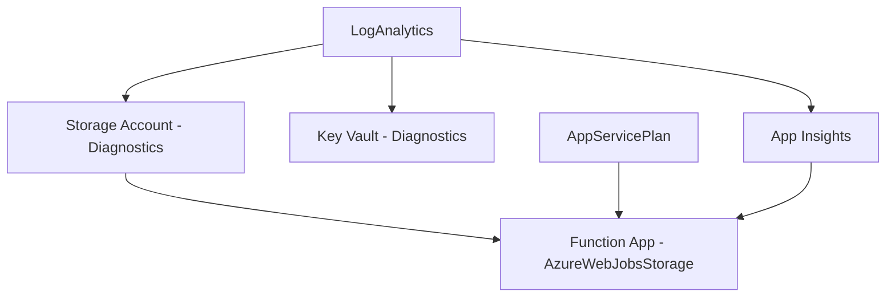

# Memory Structure: generate-azure-bicep

## Purpose

This directory stores **project-specific** Bicep infrastructure configurations, AVM module usage, and customizations. Each project gets its own subdirectory to track infrastructure definitions and evolution.

## Memory vs Context

- **Memory** (this directory): **Project-specific, dynamic** infrastructure configurations
- **Context** (`../../../context/azure/`): **Shared, static** AVM and Bicep standards

**Example**:
- Context says: "Use AVM module br/public:avm/res/storage/storage-account for Storage Accounts"
- Memory records: "This project uses Storage Account with GRS, private endpoints, and diagnostic logs enabled"

## Directory Structure

```
memory/skills/generate-azure-bicep/
├── index.md                    # This file - explains memory structure
└── {project-name}/             # Per-project memory
    ├── bicep_config.md         # Infrastructure configuration
    ├── avm_modules.md          # AVM modules used and versions
    ├── resource_naming.md      # Resource naming conventions
    └── customizations.md       # Custom wrapper modules and deviations
```

## Memory Files Per Project

### 1. `bicep_config.md`

**Purpose**: Record infrastructure setup and deployment configuration

**Contains**:
- Deployment scope (subscription, resource group)
- Environments (development, staging, production)
- Azure regions per environment
- Resource naming strategy
- Generation timestamp and skill version

**Example Content**:
```markdown
# Bicep Configuration for my-app

**Generated**: 2025-11-18 18:00:00
**Skill Version**: generate-azure-bicep v1.0.0

## Deployment Scope
- Type: Subscription (creates resource groups)
- Target Scope: subscription

## Environments
1. **Development**
   - Location: eastus
   - Resource Group: myapp-development-rg
   - SKU Strategy: Cost-optimized (LRS, Basic)

2. **Staging**
   - Location: eastus
   - Resource Group: myapp-staging-rg
   - SKU Strategy: Production-like (LRS, Standard)

3. **Production**
   - Location: eastus2
   - Resource Group: myapp-production-rg
   - SKU Strategy: High-availability (GRS, Premium)

## Resource Naming Convention
- Pattern: `{resource-abbr}-{environment}-{uniqueString}`
- Prefix: myapp
- Examples:
  - Storage: `stproduction{uniqueString}`
  - Key Vault: `kv-production-{uniqueString}`
  - Function App: `myapp-production-func`
```

---

### 2. `avm_modules.md`

**Purpose**: Track which AVM modules are used and their versions

**Contains**:
- List of all AVM modules referenced
- Module versions and why those versions were chosen
- Module purposes and configurations
- Dependency relationships between modules

**Example Content**:
```markdown
# AVM Modules for my-app

## Modules Used

| Resource | AVM Module | Version | Purpose |
|----------|------------|---------|---------|
| Storage Account | `avm/res/storage/storage-account` | 0.9.0 | Blob/Queue/Table storage |
| Key Vault | `avm/res/key-vault/vault` | 0.6.0 | Secrets management |
| Function App | `avm/res/web/site` | 0.3.0 | Serverless compute |
| App Service Plan | `avm/res/web/serverfarm` | 0.2.0 | Hosting for Function App |
| Log Analytics | `avm/res/operational-insights/workspace` | 0.3.0 | Diagnostic logs |
| App Insights | `avm/res/insights/component` | 0.3.0 | Application monitoring |

## Module Dependencies



## Version Pinning Rationale

- All modules pinned to stable versions (not latest)
- Versions tested in development environment
- Versions compatible with each other
- Update plan: Review quarterly for new features/fixes
```

---

### 3. `resource_naming.md`

**Purpose**: Document resource naming patterns and examples

**Contains**:
- Naming convention rules
- Resource type abbreviations
- Example names for each resource
- Globally unique name strategy

**Example Content**:
```markdown
# Resource Naming for my-app

## Naming Pattern

`{resource-abbr}-{environment}-{region}-{uniqueString}`

## Resource Abbreviations

| Resource Type | Abbreviation | Notes |
|---------------|--------------|-------|
| Storage Account | st | No hyphens (max 24 chars, alphanumeric) |
| Key Vault | kv | Requires uniqueString for global uniqueness |
| Function App | func | - |
| App Service Plan | plan | - |
| Resource Group | rg | - |
| Log Analytics | logs | - |
| App Insights | appi | - |

## Example Names by Environment

### Development
- Storage: `stdevelopment{uniqueString(rg.id)}`
- Key Vault: `kv-development-{uniqueString(rg.id)}`
- Function App: `myapp-development-func`
- Resource Group: `myapp-development-rg`

### Production
- Storage: `stproduction{uniqueString(rg.id)}`
- Key Vault: `kv-production-{uniqueString(rg.id)}`
- Function App: `myapp-production-func`
- Resource Group: `myapp-production-rg`

## Unique String Strategy

- Use: `uniqueString(resourceGroup().id)` for RG-scoped deployments
- Use: `uniqueString(subscription().id)` for subscription-scoped
- Ensures: Same deployment always gets same unique suffix
- Prevents: Name conflicts on redeployment
```

---

### 4. `customizations.md`

**Purpose**: Track custom wrapper modules and deviations from standard AVM usage

**Contains**:
- Custom wrapper modules created
- Reasons for wrappers (project-specific defaults)
- Deviations from standard AVM patterns
- Special configurations not in default AVM

**Example Content**:
```markdown
# Customizations for my-app

## Custom Wrapper Modules

### `.azure/bicep/modules/project-storage.bicep`

**Purpose**: Wrap AVM Storage Account with project-standard configuration

**Defaults Applied**:
- Always use StorageV2 kind
- Always set accessTier to Hot
- Always enable HTTPS only
- Always set minimumTlsVersion to TLS1_2
- Always disable public blob access
- Always include project tags

**Usage**: Simplifies storage deployment - no need to repeat these settings

**Example**:
```bicep
module rawStorage './modules/project-storage.bicep' = {
  params: {
    name: 'straw${uniqueString(resourceGroup().id)}'
    location: location
    environment: environment
  }
}
```

## Deviations from Standard AVM

### Private Endpoints for All Storage

**Reason**: Security requirement - no public access

**Implementation**:
- All storage accounts deploy with `publicNetworkAccess: 'Disabled'`
- Private endpoints configured for blob service
- Private DNS zones integrated

### Managed Identity for Function App

**Reason**: Eliminate secrets from configuration

**Implementation**:
- Function Apps use system-assigned managed identity
- Identity granted Storage Blob Data Contributor role
- No connection strings stored in app settings

## Special Configurations

### Diagnostic Settings Always Enabled

**Reason**: Compliance requirement for audit logging

**Implementation**:
- All resources include diagnosticSettings parameter
- Logs sent to central Log Analytics workspace
- Retention set to 90 days minimum
```

---

## Workflow: Using Memory

### When Generating Infrastructure

1. **Check existing memory**: Look for `{project-name}/` directory
2. **If exists**: Load all memory files to understand previous setup
3. **If not exists**: Will create after generation

### When Updating Infrastructure

1. **Load memory**: Read existing configuration
2. **Identify changes**: New resources, updated SKUs, version updates
3. **Update memory**: Record changes in relevant files

### When Adding Resources

1. **Load memory**: Understand naming conventions and patterns
2. **Apply consistency**: Use same patterns for new resources
3. **Update avm_modules.md**: Add new module references
4. **Update resource_naming.md**: Add new resource examples

## Memory Growth Pattern

1. **First generation**: All 4 files created with baseline
2. **Resource additions**: avm_modules.md and resource_naming.md updated
3. **Customizations**: customizations.md grows as wrappers added
4. **Version updates**: avm_modules.md tracks version changes

## Related Files

- `../../../context/azure/azure_verified_modules.md` - AVM concepts and usage
- `../../../context/azure/azure_bicep_overview.md` - Bicep syntax
- `../../../skills/generate-azure-bicep/SKILL.md` - Skill workflow
