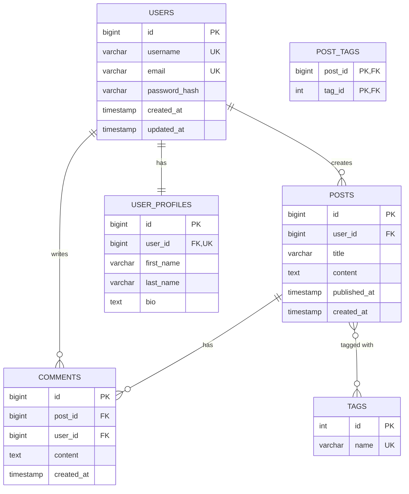
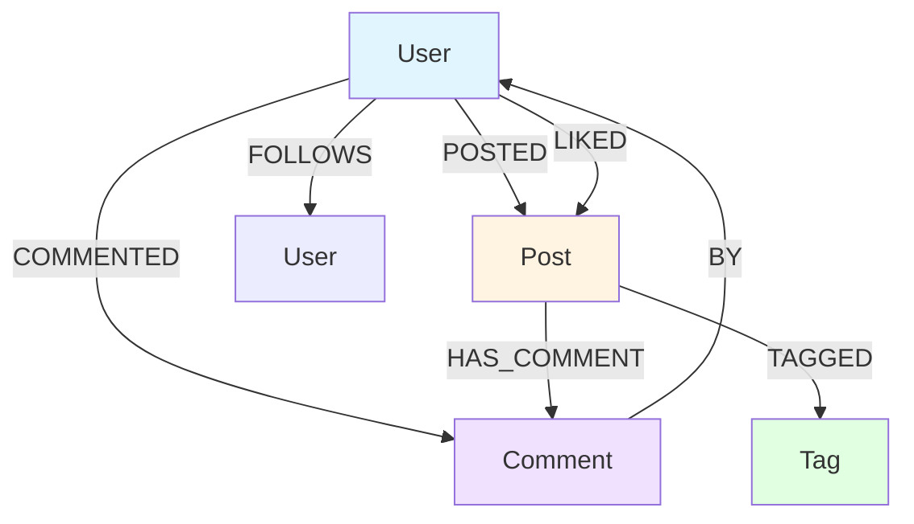

# Entity-Relationship Diagram

## Database: [database-name]

## Overview Statistics

- **Tables**: [count]
- **Relationships**: [count] foreign keys
- **Schemas**: [count]

---

## Mermaid ERD

### Full Database Schema



---

## ASCII ERD (Alternative)

### Core Entities

```
┌──────────────────────┐
│       USERS          │
├──────────────────────┤
│ PK  id               │
│ UK  username         │
│ UK  email            │
│     password_hash    │
│     created_at       │
│     updated_at       │
└──────────┬───────────┘
           │ 1
           │
           │ creates
           │
           ∨ N
┌──────────────────────┐
│       POSTS          │
├──────────────────────┤
│ PK  id               │
│ FK  user_id          │──┐
│     title            │  │ belongs to
│     content          │  │
│     published_at     │  │ 1
│     created_at       │  │
└──────────┬───────────┘  │
           │ 1            │
           │              │
           │ has          │
           │              │
           ∨ N            ∨
┌──────────────────────┐  ┌──────────────────────┐
│     COMMENTS         │  │       USERS          │
├──────────────────────┤  └──────────────────────┘
│ PK  id               │
│ FK  post_id          │
│ FK  user_id          │──────────────────────────┐
│     content          │                           │ written by
│     created_at       │                           │ N
└──────────────────────┘                           │
                                                   │ 1
                                                   ∨
```

### Many-to-Many Relationships

```
┌──────────────────────┐                    ┌──────────────────────┐
│       POSTS          │                    │        TAGS          │
│                      │                    │                      │
│ PK  id               │                    │ PK  id               │
│     title            │                    │ UK  name             │
└──────────┬───────────┘                    └──────────┬───────────┘
           │ N                                         │ N
           │                                           │
           │          ┌──────────────────┐            │
           └──────────│   POST_TAGS      │────────────┘
                      ├──────────────────┤
                      │ PK,FK  post_id   │
                      │ PK,FK  tag_id    │
                      └──────────────────┘
                      Junction Table (M:N)
```

---

## Relationship Details

### One-to-Many Relationships

| Parent | Child | FK Column | Cardinality | On Delete | On Update | Description |
|--------|-------|-----------|-------------|-----------|-----------|-------------|
| users | posts | user_id | 1:N | CASCADE | CASCADE | User creates many posts |
| users | comments | user_id | 1:N | CASCADE | CASCADE | User writes many comments |
| posts | comments | post_id | 1:N | CASCADE | CASCADE | Post has many comments |

### One-to-One Relationships

| Table 1 | Table 2 | FK Column | FK Location | On Delete | Description |
|---------|---------|-----------|-------------|-----------|-------------|
| users | user_profiles | user_id | user_profiles | CASCADE | User has exactly one profile |

### Many-to-Many Relationships

| Entity 1 | Entity 2 | Junction Table | FK1 | FK2 | Description |
|----------|----------|----------------|-----|-----|-------------|
| posts | tags | post_tags | post_id | tag_id | Posts can have multiple tags, tags can be on multiple posts |

---

## Cardinality Legend

```
||  = Exactly one (1)
|o  = Zero or one (0..1)
o{  = Zero or more (0..N)
|{  = One or more (1..N)

Example:
USERS ||--o{ POSTS
User has exactly one identity, can have zero or many posts
```

---

## Dependency Graph

### Table Dependencies (Foreign Key Order)

```
Level 0 (No Dependencies):
  ├─ users
  ├─ tags
  └─ categories

Level 1 (Depends on Level 0):
  ├─ user_profiles (→ users)
  ├─ posts (→ users)
  └─ products (→ categories)

Level 2 (Depends on Level 1):
  ├─ comments (→ users, posts)
  ├─ post_tags (→ posts, tags)
  └─ orders (→ users)

Level 3 (Depends on Level 2):
  └─ order_items (→ orders, products)
```

**Load Order**: Level 0 → Level 1 → Level 2 → Level 3
**Truncate Order**: Reverse (Level 3 → Level 2 → Level 1 → Level 0)

---

## Schema Organization

### By Functional Area

```
┌─────────────────────────────────────┐
│      USER MANAGEMENT               │
│  ┌─────────┐      ┌──────────────┐ │
│  │ users   │──────│user_profiles │ │
│  └─────────┘      └──────────────┘ │
└─────────────────────────────────────┘

┌─────────────────────────────────────┐
│      CONTENT MANAGEMENT            │
│  ┌──────┐   ┌──────────┐  ┌──────┐ │
│  │posts │───│comments  │  │tags  │ │
│  └──────┘   └──────────┘  └──────┘ │
│      └──────────┬──────────────┘    │
│           ┌──────────┐              │
│           │post_tags │              │
│           └──────────┘              │
└─────────────────────────────────────┘

┌─────────────────────────────────────┐
│      E-COMMERCE                    │
│  ┌────────┐  ┌────────────┐        │
│  │orders  │──│order_items │        │
│  └────────┘  └────────────┘        │
│      │              │              │
│      └──────┬───────┘              │
│        ┌────────┐                  │
│        │products│                  │
│        └────────┘                  │
└─────────────────────────────────────┘
```

---

## Detailed Entity Diagrams

### Users Module

```
             ┌─────────────────────────┐
             │        USERS            │
             │─────────────────────────│
             │ PK  id                  │
             │ UK  username            │
             │ UK  email               │
             │     password_hash       │
             │     is_active           │
             │     created_at          │
             │     updated_at          │
             │     last_login          │
             └────────┬────────────────┘
                      │ 1
                      │ has
                      │
                      ∨ 1
             ┌─────────────────────────┐
             │    USER_PROFILES        │
             │─────────────────────────│
             │ PK  id                  │
             │ FK,UK  user_id          │
             │     first_name          │
             │     last_name           │
             │     bio                 │
             │     avatar_url          │
             │     birth_date          │
             └─────────────────────────┘
```

### Content Module

```
┌──────────────┐         ┌──────────────┐         ┌──────────────┐
│    USERS     │         │    POSTS     │         │  COMMENTS    │
├──────────────┤         ├──────────────┤         ├──────────────┤
│ PK id        │─────┐   │ PK id        │─────┐   │ PK id        │
│    username  │     │   │ FK user_id   │     │   │ FK post_id   │
└──────────────┘     │   │    title     │     │   │ FK user_id   │
                     │   │    content   │     │   │    content   │
                     │   │ published_at │     │   │ created_at   │
                     │   └──────────────┘     │   └──────────────┘
                     │         │              │
                     │ creates │              │ has
                     │    1:N  │              │ 1:N
                     └─────────┘              └─────────
```

---

## Normalization Level Indicators

| Table | 1NF | 2NF | 3NF | BCNF | Notes |
|-------|-----|-----|-----|------|-------|
| users | ✅ | ✅ | ✅ | ✅ | Fully normalized |
| posts | ✅ | ✅ | ✅ | ✅ | Fully normalized |
| comments | ✅ | ✅ | ✅ | ✅ | Fully normalized |
| user_profiles | ✅ | ✅ | ✅ | ✅ | Fully normalized |
| post_tags | ✅ | ✅ | ✅ | ✅ | Junction table |

**Legend:**
- ✅ Compliant
- ⚠️ Partial compliance
- ❌ Violation

---

## Graph Database ERD (Neo4j)

### Node and Relationship Types

```
(User)
  │
  ├─[:POSTED]──────────>(Post)
  │                        │
  ├─[:COMMENTED]───────────┼─[:HAS_COMMENT]──>(Comment)
  │                        │
  ├─[:LIKED]───────────────┤
  │                        │
  └─[:FOLLOWS]────────>(User)
                           │
                           └─[:TAGGED]──>(Tag)
```

### Mermaid Graph



---

## NoSQL Collection Relationships

### MongoDB Document References

```javascript
// users collection
{
  _id: ObjectId("..."),
  username: "john_doe",
  email: "john@example.com",
  profile: {  // Embedded document (1:1)
    firstName: "John",
    lastName: "Doe",
    bio: "..."
  }
}

// posts collection
{
  _id: ObjectId("..."),
  user_id: ObjectId("..."),  // Reference (N:1)
  title: "Post Title",
  tags: [ObjectId("..."), ...]  // Array of references (M:N)
}

// comments collection
{
  _id: ObjectId("..."),
  post_id: ObjectId("..."),  // Reference (N:1)
  user_id: ObjectId("..."),  // Reference (N:1)
  content: "..."
}
```

### Relationship Patterns

- **Embedding**: 1:1 and 1:Few relationships (profile in user)
- **Referencing**: 1:Many and Many:Many relationships (posts, comments, tags)

---

## Index Visualization

### Indexed Columns (✓)

```
USERS
├─ ✓ id (PRIMARY KEY)
├─ ✓ username (UNIQUE)
├─ ✓ email (UNIQUE)
└─   created_at

POSTS
├─ ✓ id (PRIMARY KEY)
├─ ✓ user_id (FOREIGN KEY - INDEXED)
├─ ✓ (user_id, created_at) (COMPOSITE)
└─   published_at (! MISSING INDEX !)

COMMENTS
├─ ✓ id (PRIMARY KEY)
├─   post_id (! MISSING INDEX !)
└─   user_id (! MISSING INDEX !)
```

**Legend:**
- ✓ = Indexed
- ! = Missing recommended index

---

## Change History

| Version | Date | Changes | Author |
|---------|------|---------|--------|
| 1.0 | 2024-01 | Initial schema | Team |
| 1.1 | 2024-06 | Added user_profiles | Team |
| 2.0 | 2025-01 | Added tags, post_tags | Team |

---

**Diagram Generated**: [timestamp]
**Tool**: database-schema-analysis skill v1.0.0
**Format**: Mermaid + ASCII
