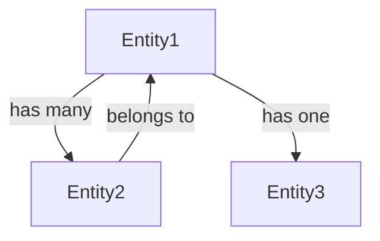

# Schema Analysis Report

## Executive Summary

**File**: [file-path]
**Format**: [JSON Schema | Protobuf | GraphQL | OpenAPI | Avro | XML/XSD | YAML]
**Version**: [schema-version]
**Analyzed**: [date]
**Complexity**: [Low | Medium | High] ([number] fields, [number] nested objects)

### Key Findings
- [Summary point 1]
- [Summary point 2]
- [Summary point 3]

---

## File Inventory

| File Path | Format | Version | Size | Lines | Entities | Fields |
|-----------|--------|---------|------|-------|----------|--------|
| | | | | | | |

---

## Schema Overview

### Purpose
[What this schema represents and its role in the system]

### Scope
[What data/entities are covered by this schema]

### Dependencies
[External schemas, imports, or references]

---

## Field Catalog

### [Entity/Type Name 1]

**Description**: [Entity description]

| Field Path | Type | Required | Default | Constraints | Description |
|------------|------|----------|---------|-------------|-------------|
| | | | | | |

### [Entity/Type Name 2]

**Description**: [Entity description]

| Field Path | Type | Required | Default | Constraints | Description |
|------------|------|----------|---------|-------------|-------------|
| | | | | | |

---

## Type System

### Primitive Types Used
- [ ] String
- [ ] Integer/Number
- [ ] Boolean
- [ ] Date/Timestamp
- [ ] Binary/Bytes
- [ ] Null/Optional

### Complex Types
- [ ] Arrays/Lists
- [ ] Objects/Records
- [ ] Maps/Dictionaries
- [ ] Unions/OneOf
- [ ] Enums
- [ ] References ($ref)

### Custom Types
[List of custom/user-defined types]

---

## Validation Rules

### Field-Level Validations

#### String Validations
| Field | Rule | Value |
|-------|------|-------|
| [field-name] | minLength | [value] |
| [field-name] | maxLength | [value] |
| [field-name] | pattern | [regex] |
| [field-name] | format | [email/uuid/date/uri/etc] |

#### Numeric Validations
| Field | Rule | Value |
|-------|------|-------|
| [field-name] | minimum | [value] |
| [field-name] | maximum | [value] |
| [field-name] | multipleOf | [value] |

#### Array Validations
| Field | Rule | Value |
|-------|------|-------|
| [field-name] | minItems | [value] |
| [field-name] | maxItems | [value] |
| [field-name] | uniqueItems | [true/false] |

### Cross-Field Validations
[Dependencies, conditional requirements, etc.]

### Business Rules
[Complex validation logic and business constraints]

---

## Relationships

### Entity Relationships



### Type Hierarchy

```
Root
├── Entity1
│   ├── NestedObject1
│   └── NestedObject2
└── Entity2
    └── NestedObject3
```

### References and Dependencies

| Source | Target | Type | Description |
|--------|--------|------|-------------|
| | | $ref / FK / Import | |

---

## Documentation Coverage

### Well-Documented Elements
- ✅ [Element with good documentation]
- ✅ [Element with examples]

### Missing Documentation
- ❌ [Element missing description]
- ❌ [Element missing examples]

### Documentation Quality Score
[X/Y] fields have descriptions ([percentage]%)

---

## Quality Assessment

### ✅ Best Practices Followed
1. [Practice 1]
2. [Practice 2]
3. [Practice 3]

### ⚠️ Anti-Patterns Detected
1. **[Anti-pattern name]**
   - Location: [where]
   - Impact: [severity]
   - Recommendation: [how to fix]

### 🔍 Code Smells
- [Smell 1]: [description]
- [Smell 2]: [description]

---

## Schema Quality Metrics

| Metric | Value | Rating |
|--------|-------|--------|
| Total Fields | [number] | - |
| Required Fields | [number] ([percentage]%) | - |
| Documented Fields | [number] ([percentage]%) | [Good/Fair/Poor] |
| Fields with Constraints | [number] ([percentage]%) | [Good/Fair/Poor] |
| Max Nesting Depth | [number] levels | [Good/Fair/Poor] |
| Unique Constraints | [number] | - |
| Default Values | [number] | - |

**Overall Quality Score**: [score/10]

---

## Version and Evolution

### Current Version
- Version: [version]
- Released: [date]
- Compatibility Mode: [BACKWARD | FORWARD | FULL | NONE]

### Version History
| Version | Date | Changes | Breaking |
|---------|------|---------|----------|
| | | | Yes/No |

### Evolution Recommendations
1. [Recommendation for future versions]
2. [Backward compatibility suggestion]

---

## Security Considerations

### Sensitive Data Fields
| Field | Data Type | PII | Encryption Recommended |
|-------|-----------|-----|------------------------|
| | | Yes/No | Yes/No |

### Security Concerns
- [ ] Password/secret fields without format constraints
- [ ] Missing email validation on email fields
- [ ] PII fields without explicit marking
- [ ] Overly permissive string patterns
- [ ] Missing maxLength on text fields (DoS risk)

---

## Performance Considerations

### Index Recommendations
[For database-backed schemas]
- Index on: [field-name] (reason: frequently queried)
- Composite index: [field1, field2] (reason: common query pattern)

### Optimization Opportunities
1. [Opportunity 1]
2. [Opportunity 2]

### Size and Complexity Warnings
- ⚠️ [Warning about deeply nested objects]
- ⚠️ [Warning about large array fields]

---

## Integration and Usage

### Supported Formats/Protocols
- [ ] REST API (JSON)
- [ ] gRPC (Protobuf)
- [ ] GraphQL
- [ ] Message Queue (Kafka/RabbitMQ)
- [ ] Database ORM

### Language Bindings
[Languages that can generate code from this schema]
- [ ] Python
- [ ] JavaScript/TypeScript
- [ ] Java
- [ ] C#
- [ ] Go

### Tooling Compatibility
- [ ] JSON Schema Validator
- [ ] OpenAPI Generator
- [ ] Protobuf Compiler
- [ ] GraphQL Code Generator

---

## Recommendations

### High Priority
1. **[Issue/Improvement]**
   - Current State: [description]
   - Proposed Change: [description]
   - Impact: [HIGH | MEDIUM | LOW]
   - Effort: [HIGH | MEDIUM | LOW]

### Medium Priority
1. **[Issue/Improvement]**
   - Current State: [description]
   - Proposed Change: [description]
   - Impact: [HIGH | MEDIUM | LOW]
   - Effort: [HIGH | MEDIUM | LOW]

### Low Priority / Nice to Have
1. [Improvement]
2. [Enhancement]

---

## Migration Guide

### From Previous Version
[If comparing versions]

**Breaking Changes**:
1. [Change description]
   - Migration steps: [how to adapt]

**Non-Breaking Changes**:
1. [Change description]

**Recommended Migration Steps**:
1. [Step 1]
2. [Step 2]
3. [Step 3]

---

## Sample Data

### Valid Example
```json
{
  "example": "value"
}
```

### Invalid Examples
```json
// Missing required field
{
  "invalid": "example"
}
```

---

## Appendix

### Full Schema Definition
[Link or embedded full schema]

### Related Documentation
- [Link to API docs]
- [Link to data dictionary]
- [Link to migration guides]

### Tools and Validators
- [Validation tool recommendations]
- [Schema testing tools]

---

**Report Generated**: [timestamp]
**Analyzed by**: file-schema-analysis skill v1.0.0
**Project**: [project-name]
