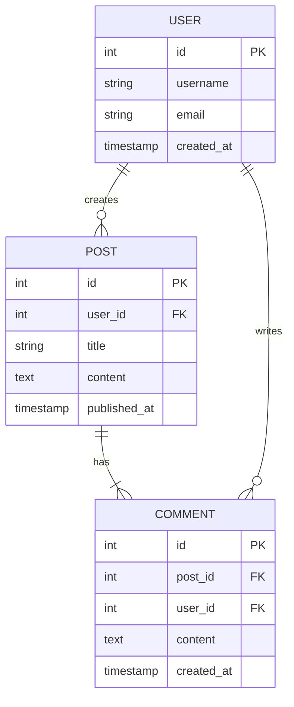
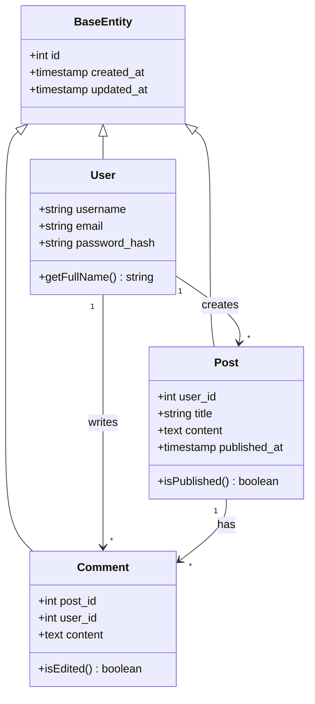
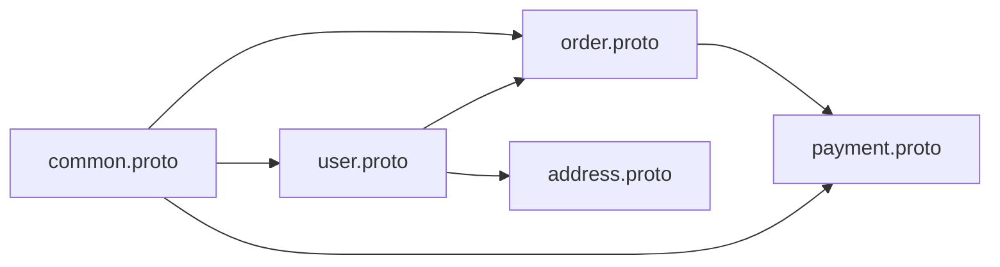
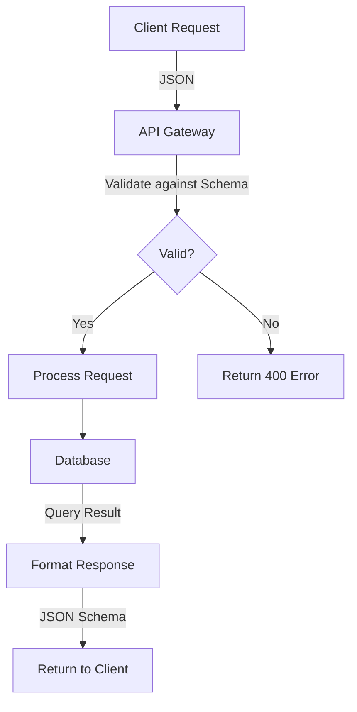
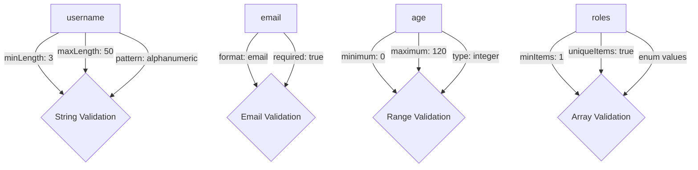
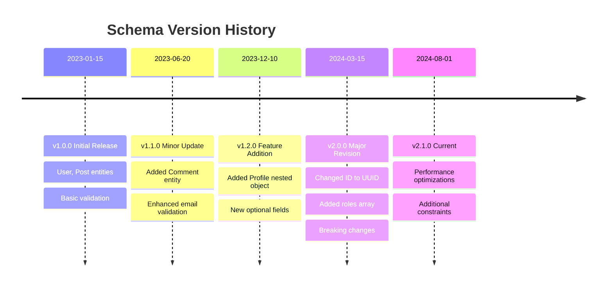

# Schema Visualization

## Entity-Relationship Diagram

### Mermaid ER Diagram



### ASCII Diagram (Alternative)

```
┌─────────────────┐
│      USER       │
├─────────────────┤
│ id (PK)         │
│ username        │
│ email           │
│ created_at      │
└────────┬────────┘
         │
         │ 1:N
         │
┌────────┴────────┐
│      POST       │
├─────────────────┤
│ id (PK)         │
│ user_id (FK)    │
│ title           │
│ content         │
│ published_at    │
└────────┬────────┘
         │
         │ 1:N
         │
┌────────┴────────┐
│     COMMENT     │
├─────────────────┤
│ id (PK)         │
│ post_id (FK)    │
│ user_id (FK)    │
│ content         │
│ created_at      │
└─────────────────┘
```

---

## Type Hierarchy

### Mermaid Class Diagram



### Tree View

```
Schema Root
│
├── Entities
│   ├── User (primary entity)
│   │   ├── id: integer (PK)
│   │   ├── username: string
│   │   ├── email: string
│   │   ├── profile: object
│   │   │   ├── firstName: string
│   │   │   ├── lastName: string
│   │   │   └── bio: text
│   │   ├── roles: array[string]
│   │   └── metadata: object
│   │       ├── created_at: timestamp
│   │       └── last_login: timestamp
│   │
│   ├── Post (secondary entity)
│   │   ├── id: integer (PK)
│   │   ├── user_id: integer (FK → User)
│   │   ├── title: string
│   │   ├── content: text
│   │   ├── tags: array[string]
│   │   └── published_at: timestamp
│   │
│   └── Comment (tertiary entity)
│       ├── id: integer (PK)
│       ├── post_id: integer (FK → Post)
│       ├── user_id: integer (FK → User)
│       ├── content: text
│       └── created_at: timestamp
│
└── Enumerations
    ├── Role: [user, admin, moderator, guest]
    └── PostStatus: [draft, published, archived]
```

---

## Dependency Graph

### Import/Reference Dependencies



### File Dependencies (ASCII)

```
common.proto (base definitions)
    ↓
    ├──→ user.proto (imports common)
    │       ↓
    │       └──→ address.proto (imports user, common)
    │
    └──→ order.proto (imports common, user)
            ↓
            └──→ payment.proto (imports order, common)
```

---

## Data Flow Diagram



---

## Cardinality Map

### Relationship Cardinality Matrix

| Entity 1 | Relationship | Entity 2 | Type | Description |
|----------|--------------|----------|------|-------------|
| User | creates | Post | 1:N | One user can create many posts |
| User | writes | Comment | 1:N | One user can write many comments |
| Post | has | Comment | 1:N | One post can have many comments |
| User | has | Profile | 1:1 | One user has exactly one profile |
| Post | has | Tags | 1:N | One post can have many tags |

---

## Field Distribution

### By Type

```
String Fields:     ████████████████░░░░  45% (18 fields)
Integer Fields:    ████████░░░░░░░░░░░░  20% (8 fields)
Timestamp Fields:  ████░░░░░░░░░░░░░░░░  15% (6 fields)
Boolean Fields:    ███░░░░░░░░░░░░░░░░░  10% (4 fields)
Array Fields:      ██░░░░░░░░░░░░░░░░░░   7% (3 fields)
Object Fields:     █░░░░░░░░░░░░░░░░░░░   3% (1 field)
```

### By Constraint Type

```
Required Fields:        ████████████████░░░░  60% (24 fields)
Optional Fields:        ████████░░░░░░░░░░░░  40% (16 fields)
With Default Values:    ████░░░░░░░░░░░░░░░░  15% (6 fields)
With Pattern Validation: ███░░░░░░░░░░░░░░░░░  12% (5 fields)
With Range Constraints:  ██░░░░░░░░░░░░░░░░░░   8% (3 fields)
```

---

## Complexity Heatmap

| Entity/Type | Fields | Nesting Depth | Required % | Constraints | Complexity Score |
|-------------|--------|---------------|------------|-------------|------------------|
| User | 12 | 2 levels | 75% | High | ████████░░ 8/10 |
| Post | 8 | 1 level | 60% | Medium | ██████░░░░ 6/10 |
| Comment | 5 | 0 levels | 80% | Low | ████░░░░░░ 4/10 |
| Profile | 6 | 1 level | 50% | Medium | █████░░░░░ 5/10 |

**Legend:**
- Complexity Score = f(field count, nesting depth, constraint density)
- Higher score = More complex to implement/maintain

---

## Validation Rule Network



---

## Schema Evolution Timeline



---

## Reference Map

### Cross-Schema References

| Source Schema | Field | Target Schema | Target Type | Description |
|---------------|-------|---------------|-------------|-------------|
| post.proto | author_id | user.proto | User | References user who created post |
| comment.proto | post_id | post.proto | Post | References parent post |
| order.proto | user_id | user.proto | User | References ordering user |

### $ref Resolution Tree

```
user-schema.json
├── $ref: #/definitions/Address
│   └── $ref: #/definitions/Country
├── $ref: #/definitions/Profile
└── $ref: common.json#/definitions/Timestamp

common.json
├── definitions/Timestamp
├── definitions/Currency
└── definitions/Language
```

---

## Visualization Legend

### Symbols and Meanings

**Entity Relationships:**
- `||--o{` : One-to-many
- `||--||` : One-to-one
- `}o--o{` : Many-to-many
- `-->` : Has/Contains
- `FK` : Foreign Key
- `PK` : Primary Key

**Type Indicators:**
- `int`, `integer` : Integer number
- `string`, `text` : Text/String
- `timestamp`, `date` : Date/Time
- `boolean`, `bool` : True/False
- `array`, `[]` : List/Array
- `object`, `{}` : Nested Object/Record

**Constraint Indicators:**
- `!` : Required field
- `?` : Optional field
- `*` : Zero or more (array)
- `+` : One or more (array)
- `~` : Pattern/Regex validation
- `#` : Unique constraint

---

## Interactive Elements

### Quick Navigation

- [Jump to Entity Relationships](#entity-relationship-diagram)
- [Jump to Type Hierarchy](#type-hierarchy)
- [Jump to Dependency Graph](#dependency-graph)
- [Jump to Complexity Heatmap](#complexity-heatmap)

### Filtering Options

When viewing interactively:
- Filter by entity type
- Show/hide optional fields
- Highlight required fields
- Color-code by data type
- Expand/collapse nested objects

---

**Visualization Generated**: [timestamp]
**Tool**: file-schema-analysis skill v1.0.0
**Format**: Mermaid + ASCII + Markdown Tables
